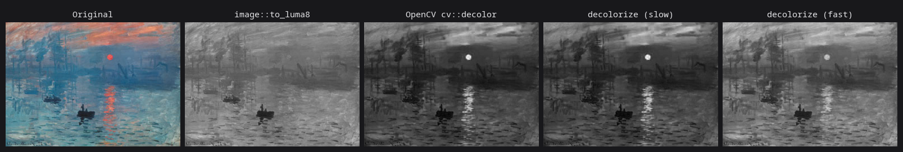

# decolorize

Contrast preserving decolorization (Lu, Xu & Jia) in Rust.

Ordinary color-to-gray conversions map each color onto its luminance, so colors
that differ only in chrominance collapse onto the same gray. This crate
implements the algorithm that instead fits the global mapping which best
reproduces the *contrast* of every neighboring pixel pair.



Monet's sun sits at almost exactly the luminance of the sky behind it, so
`image`'s own conversion erases it. Both variants here recover it, and the
polynomial one tracks `cv::decolor`, the authors' own implementation.

|                  | `decolorize`                                | `decolorize_fast`                       |
| ---------------- | ------------------------------------------- | --------------------------------------- |
| Paper            | ICCP 2012 / IJCV 2014                       | SIGGRAPH Asia 2012 Technical Brief       |
| Model            | degree-2 polynomial, 9 coefficients          | convex combination of the three channels |
| Solver           | fixed point iteration on the bimodal likelihood | exhaustive search over 66 candidates |
| Contrast measure | CIELAB distance                              | RGB distance                             |
| 12 MP image      | 215 ms                                       | 16 ms                                    |

```rust
use decolorize::decolorize::{decolorize, decolorize_fast};

let gray = decolorize(&image);       // full quality
let gray = decolorize_fast(&image);  // real-time
```

Both accept any `image` pixel type (`Rgb`, `Rgba`, `Luma`, …) with `u8`, `u16`,
`f32` or `f64` samples, and return `Image<Luma<_>>` of the same sample type.
Options are available through `decolorize_with` and `decolorize_fast_with`.

## Validation

Checked against `cv::decolor`, which is the authors' own implementation, on the
24 image benchmark linked from the [project page][project], using CCPR (the
Color Contrast Preserving Ratio defined in the IJCV paper) at τ = 15.

| method                    | mean CCPR |
| ------------------------- | --------- |
| Rec. 601 luminance        | 0.728     |
| `cv::decolor`             | 0.836     |
| `decolorize`              | 0.833     |
| `decolorize_fast`         | 0.845     |

Mean absolute correlation between this crate's output and `cv::decolor`'s is
0.992 over the benchmark. Pinning the iteration count to the same value makes
the nine fitted coefficients agree to within about 0.03 — see below for why the
default differs — and the port is roughly 17× faster than `cv::decolor` on a
12 MP image (215 ms against 3.6 s).

`decolorize_fast` scoring slightly above `decolorize` on raw CCPR is expected:
CCPR only counts whether contrast survives, while the polynomial variant
optimizes a perceptual objective in CIELAB and wins on the E-score metric the
papers pair CCPR with.

### One deliberate deviation from `cv::decolor`

`cv::decolor` measures convergence with an energy that omits the weak order
weights and reads `σ` where the rest of the algorithm reads `2σ²`. That makes
its energy far smoother than the objective actually being minimized, so its
default tolerance trips after about three iterations rather than the fifteen the
paper specifies. This crate evaluates the objective as published, so it keeps
iterating and reproduces the coefficient trajectory tabulated in the paper.
Contrast preservation is unaffected, as the table above shows.

## Upstreaming into imageproc

The crate is a staging area: `src/decolorize.rs` is written to drop into
[`imageproc`] as `src/decolorize.rs` with no changes to its dependencies.

* It uses only `image`, `nalgebra` and `rayon`, all of which imageproc already
  depends on, behind the same `rayon` feature gate. No new dependency is added.
* It imports `crate::definitions::Image` — `src/definitions.rs` here is a
  cut-down copy of imageproc's, so the import resolves unchanged.
* Bounds follow imageproc's convention of constraining the pixel type
  (`P: Pixel`) rather than the subpixel type, which also sidesteps `image`'s
  unexported `Enlargeable` bound on `Rgb<T>: Pixel`.
* Results are byte-identical with and without `rayon`: every floating point
  reduction is split into fixed size chunks and combined in index order, so
  enabling the feature changes the speed and nothing else.

To upstream: copy `src/decolorize.rs`, add `pub mod decolorize;` to
`imageproc/src/lib.rs`, and rewrite the three `use decolorize::decolorize::…`
lines in the doc examples as `use imageproc::decolorize::…`.

The dependency direction that motivated the original design — a crate that
`image` itself could depend on — is not a constraint here, since imageproc sits
above `image` rather than below it.

## Development

```sh
cargo test
cargo test --no-default-features --features image/default   # without rayon
cargo run --release --example decolorize_image -- OUT_DIR IMAGE [IMAGE ...]
```

`rust-toolchain.toml` pins a toolchain for local use only; it is not part of
what gets upstreamed. imageproc declares `rust-version = 1.87`, but nalgebra
0.35 requires 1.89, so the effective floor is higher than the manifest suggests.

## References

* Cewu Lu, Li Xu, Jiaya Jia. *Contrast Preserving Decolorization*. ICCP 2012.
* Cewu Lu, Li Xu, Jiaya Jia. *Contrast Preserving Decolorization with
  Perception-Based Quality Metrics*. IJCV 2014.
* Cewu Lu, Li Xu, Jiaya Jia. *Real-time Contrast Preserving Decolorization*.
  SIGGRAPH Asia 2012 Technical Briefs.

[project]: https://www.cse.cuhk.edu.hk/~leojia/projects/color2gray/
[`imageproc`]: https://github.com/image-rs/imageproc

## License

MIT.
